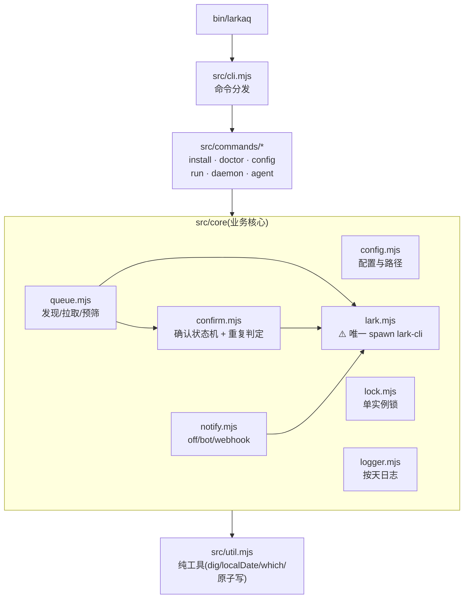
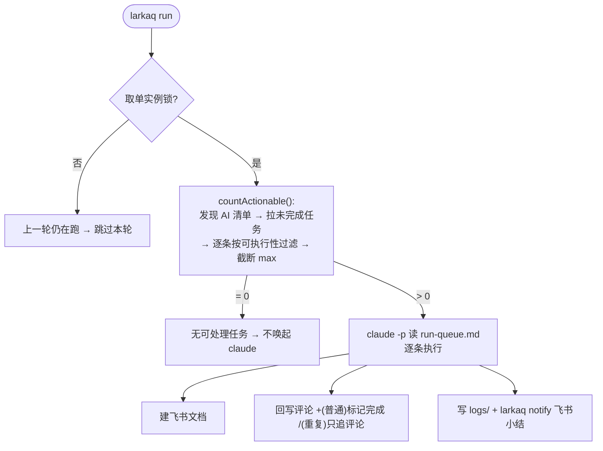
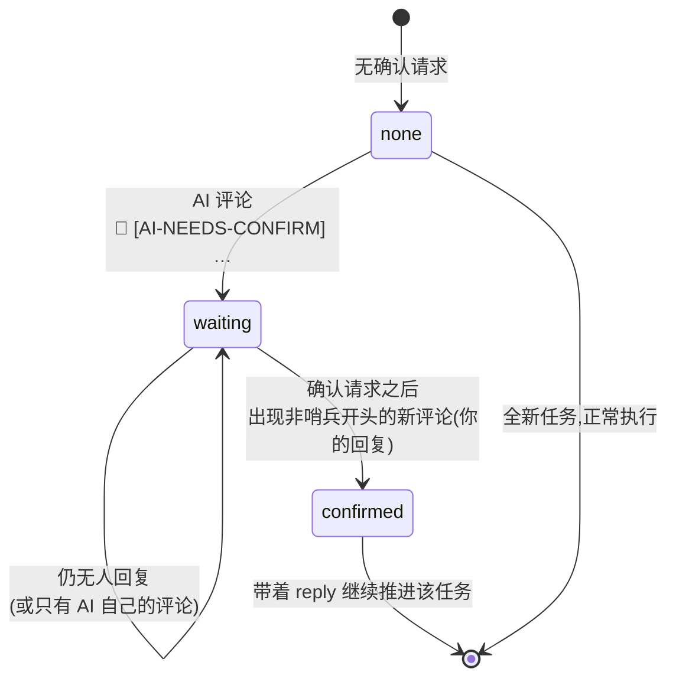
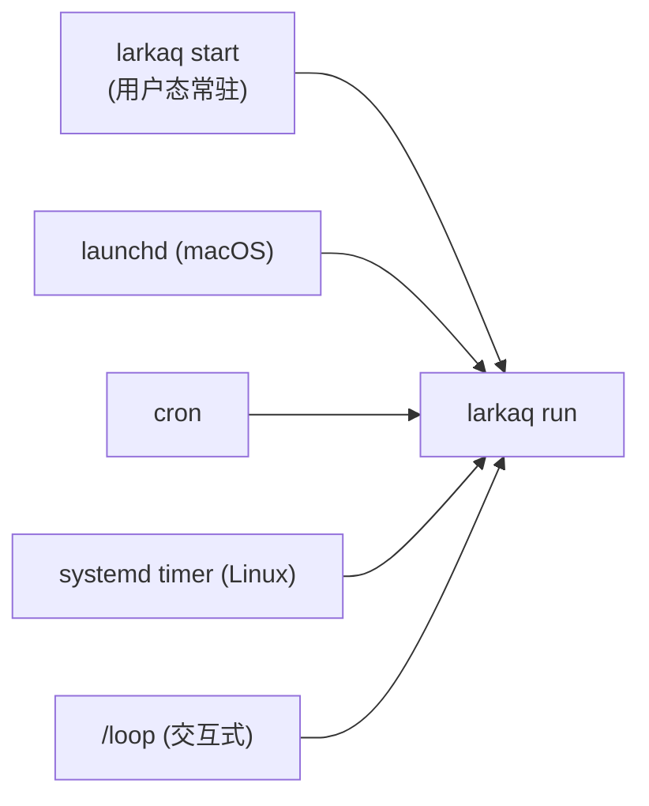

# 架构 / Architecture

> 纯 Node.js CLI,零三方依赖。核心原则:**纯逻辑与 I/O 分离** —— 状态机、过滤、时区计算
> 都是纯函数(`src/core` 里,可直接单测);唯一 spawn `lark-cli` 的地方收敛在 `core/lark.mjs`。

## 模块依赖

纯函数(无 I/O,被 `test/` 直接覆盖):`util.dig/setDeep/localDate/nowStamp/which`、
`confirm.evaluateConfirmation/recurringDoneOn/isRecurringText/isActionable/normalizeComments`、
`queue.filterTasklists/projectTask/selectActionable`、`config.validateConfig`、
`lark.collectPaged`、`notify.webhookTextPayload`。

## 一轮执行的数据流

## 异步人工确认状态机

`confirm.evaluateConfirmation(comments, marker, sentinel)` —— 靠哨兵 `🤖` 区分人机评论。

- **确认请求**必须是 AI 评论(`startsWith(🤖)` 且 `includes([AI-NEEDS-CONFIRM])`),
  所以你回复里引用该标记不会被误判为新的确认请求。
- **重复任务**的"今天已干过"只认含成功标记(`✅`)的 AI 评论,失败评论(`🤖 ❌`)不阻断当日重试。

## 调度形态

`larkaq run` 是所有 headless 方式的统一入口(单实例锁防重叠):

详见 [DEPLOY.md](DEPLOY.md)。
