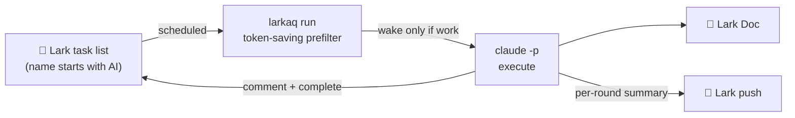

# Lark AI Task Queue


[简体中文](README.md) · **English**

> Treat a **Feishu/Lark task list** as an "async to-do queue addressed to an AI": jot a task into a
> dedicated list, and the AI polls it on a schedule, does the work, ships a Lark Doc, then writes the
> result back as a comment and marks the task done.

**Core idea:** reuse a mature to-do tool (Lark Tasks) as the data source and UI; the AI only does
"poll → execute → write back". No home-grown to-do layer.



---

## 💡 Why

I wanted a place to **record to-dos asynchronously and have an AI pull and run them on a schedule** —
without sitting at my desk. Drop a task in from anywhere; the AI does it at the agreed time.

Why Lark? Because my own work runs on Lark — it's a pleasant collaboration tool with a built-in
**Tasks module** usable from both web and the mobile app. I reuse it as the entry layer and data
source, writing zero lines of to-do plumbing.

Lark Tasks natively supports three execution shapes, which map to two use cases:

- **One-off tasks → an async work queue.** On the road, on the subway, anywhere: jot "research X, write
  a one-pager", and the AI pulls it, runs it, and writes the Lark Doc link back to the task. It is
  essentially **an async to-do queue addressed to an AI**.
- **Scheduled / recurring tasks → automated routines.** Using Lark Tasks' own "scheduled" and
  "recurring" rules, hand periodic work — stats jobs, article writing/publishing, weekly reports — to
  it and let it run on its own.

A handy tip for **Claude Pro** users: Pro quota is bound to a **rolling 5-hour window**. Schedule
heavy tasks to **run overnight or in idle hours**, and you spread quota out / digest heavy work
off-peak instead of cramming it into the hours you're staring at the screen.

---

## ✨ Features

- **No home-grown to-do layer**: data, entry, and progress all live in native Lark Tasks (web/mobile).
- **Convention over configuration**: a list whose name starts with `AI` is auto-discovered as a queue;
  no manual guid. `name→guid` is cached.
- **Minimal dependencies**: core needs only `lark-cli` + `claude`. The tool itself is **pure Node with
  zero third-party npm deps** (`node` ships with `lark-cli`).
- **Cross-platform**: runs identically on macOS and Linux servers (all-Node, no bash portability traps).
- **Isolation & safety**: only touches `AI`-prefixed lists; never your other tasks.
- **Async human confirmation**: when a task needs a decision, it comments a question and parks; you
  reply whenever, and it resumes next round.
- **Recurring/daily tasks**: tasks marked `[每日]`/`[daily]` only get an appended comment when done
  (never crossed off), at most once per day (timezone configurable).
- **Per-round Lark push**: a summary DM after each round (done/awaiting/failed + doc links); channel
  `off`/`bot`/`webhook`.
- **Unattended**: `larkaq start` (user-space), launchd / cron / systemd — your pick; single-instance
  lock prevents overlap, idle rounds don't burn tokens.

## 🚀 Quick start

### 0. Prerequisites

| Dependency | Purpose | Install |
|---|---|---|
| `lark-cli` | Calls Lark task/doc/message APIs | See [lark-cli docs](https://github.com/larksuite). It is a node script, so **installing it brings `node`** |
| `claude` (Claude Code) | The AI executor | `npm i -g @anthropic-ai/claude-code` |

> That's it. JSON parsing and HTTP use Node built-ins — **no jq / curl needed**. `node ≥ 18`
> (already satisfied by `lark-cli`).

### 1. Install & bootstrap (one-time)
```bash
git clone https://github.com/diguike/lark-ai-task-queue.git
cd lark-ai-task-queue
npm i -g .          # optional: put larkaq on your PATH; otherwise use ./larkaq
larkaq install      # check deps, generate config.json, guide login, discover AI lists
```
> Note: after a global install, `config/`, `logs/`, and `state.json` still live under the repo
> directory (the tool reads `prompts/run-queue.md` and config relative to the install root).

### 2. Lark app + login
Register a Lark app for lark-cli with scopes `task:*`, `im:message`, `docx:document:create`, `docs:*`,
then follow the `install` prompts:
```bash
lark-cli config init
lark-cli auth login --scope "task:task:write task:tasklist:read task:comment:write docx:document:create"
```
> Only one user login is needed; the bot identity comes from the same app automatically.

### 3. Create a queue list
In Lark, create a task list whose **name starts with `AI`** (e.g. `AI Queue`). It's auto-discovered.

### 4. Run a round
Add a task (e.g. "research X, write a one-pager"), then:
```bash
larkaq doctor          # health check: deps / auth / config / lists
larkaq run --dry-run   # see what this round would process (prefilter only, no claude)
larkaq run             # real round (pull → execute → doc → write back → complete → log → push)
```

### 5. Schedule it
Simplest:
```bash
larkaq start    # user-space background daemon; larkaq stop to stop
```
For long-running unattended setups (launchd / cron / systemd) see **[DEPLOY.md](DEPLOY.md)**.

## 🧭 Commands

```
larkaq install              first-run bootstrap
larkaq doctor               health check
larkaq config list|get|set  view / set config (sensitive values redacted)
larkaq run [--dry-run]      run one round
larkaq start|stop|status|logs   background daemon
larkaq --version            print version
```
Plus a set of atomic ops used by the AI executor (`prompts/run-queue.md`): `queue pull`,
`confirm-state`, `comment`, `complete`, `doc`, `notify`, etc. Run `larkaq --help` for the full list.

## ⚙️ Configuration (`config/config.json`)

| Section | Key | Meaning |
|---|---|---|
| `queue` | `tasklist_name_prefix` | List-name prefix (default `AI`); a match is enqueued |
| | `tasklist_guids` | Optional allowlist; if non-empty, only these guids (prefix ignored) |
| `execution` | `max_tasks_per_run` | Max tasks per round |
| | `poll_interval_minutes` | `larkaq start` poll interval (launchd/cron must match separately) |
| | `timezone` | Timezone for the "daily" check (empty = local; set e.g. `Asia/Shanghai` on UTC servers) |
| | `require_confirmation_for_risky` | Park risky tasks (delete/send/spend) for confirmation |
| `confirmation` | `needs_confirm_marker` / `ai_sentinel` / `ai_success_mark` | Markers/sentinel to tell human vs AI comments and to detect success |
| `recurring` | `markers` | Match → only append a comment when done (at most once/day) |
| `output` | `create_lark_doc` / `doc_folder_token` | Whether to create a doc, and which folder |
| | `mark_task_done_on_success` | Mark complete on success (except recurring) |
| `notify` | `channel` | `off` / `bot` (set `user_open_id`) / `webhook` (set `webhook_url`) |

Use `larkaq config set notify.channel webhook` — no hand-editing JSON.

## 🔒 Security

- **Only touches `AI`-prefixed lists**; never deletes tasks or alters list structure; recurring tasks
  are never crossed off automatically.
- **Risky gate**: delete/send/spend tasks are parked for confirmation by default.
- **Headless requires `--dangerously-skip-permissions`** (no one to approve unattended); safety relies
  on the gate above.
- **No secrets/PII committed**: `config.json`, `state.json`, `logs/` are gitignored; appSecret lives in
  `~/.lark-cli`. `config list` redacts `webhook_url` / `user_open_id`. See [SECURITY.md](SECURITY.md).

## 🧪 Develop / test

```bash
node --test      # run unit tests (zero deps, pure logic fully covered)
larkaq run --dry-run   # end-to-end dry run (prefilter only)
```
Core logic (confirmation state machine, list filtering, recurrence, timezone) is pure functions in
`src/core/`. Module dependencies, data flow, and state-machine diagrams: **[ARCHITECTURE.md](ARCHITECTURE.md)**.

## 🤝 Contributing

See [CONTRIBUTING.md](CONTRIBUTING.md). Key invariants: no home-grown to-do layer, **zero third-party
runtime deps**, convention over configuration, only touch `AI`-prefixed lists, fail soft.

## 📄 License

[MIT](LICENSE) © diguike
