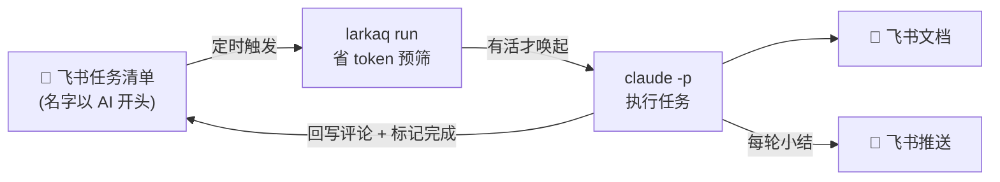

# Lark AI Task Queue


**简体中文** · [English](README.en.md)

> 把**飞书任务清单**当成"寄给 AI 的待办队列"——你在专属清单里记一条任务,AI 定时拉取、自动执行,产出飞书文档,完成后回写评论并标记完成。
>
> *Turn a Feishu/Lark task list into an async work queue for an AI agent: it polls unfinished tasks on a schedule, does the work, ships a Lark Doc, and writes the result back to the task.*



**核心理念**:复用成熟的 todo 工具(飞书任务)当数据源和界面,AI 只负责"定时拉取 + 执行 + 回写",不自研 todo 层。

---

## 💡 缘起 / Why

我想要一个能**异步记录 todo、再让 AI 定时拉取执行**的地方:不必守在电脑前,随手把一条任务丢进去,AI 会在约定的时间替我把它做掉。

为什么选飞书?因为我自己的工作环境本来就用飞书——它是非常顺手的协作工具,而且**自带 Task 任务模块**,既能在网页用,也能在手机 App 里随手记。我直接复用它当任务录入层和数据源,一行 todo 层代码都不用自己写。

飞书任务原生支持三种执行形态,刚好对上两类用法:

- **单次任务 → 异步任务队列**。在路上、在地铁、在任何地方,手机上记一条「调研 X 写个总结」,AI 定时拉取、跑完、把飞书文档链接回写到任务下。它本质就是一条**寄给 AI 的异步待办队列**。
- **定时 / 重复任务 → 自动化例行工作**。靠飞书任务自带的「定时」和「重复」规则,可以把统计任务、文章发布与写作、周报撰写等**周期性活儿**交给它自动跑,应用场景非常广。

还有一个对 **Claude Pro 订阅用户**很实用的小 tips:Pro 账号的额度受**每 5 小时滚动窗口**限制。把一些耗时任务用定时/重复规则**排到夜间或闲暇时段异步执行**,就能把额度铺开用、错峰消化重活,而不是攒在你盯着屏幕的那几个小时里——这本身就是一个很香的用法。

---

## ✨ 特性

- **零自研 todo**:数据源、录入、进度都用飞书任务原生界面,手机/网页都能记。
- **约定优于配置**:清单名以 `AI` 前缀开头即被自动当作队列,无需手填 guid;`name→guid` 自动缓存。
- **依赖极简**:核心只要 `lark-cli` + `claude`。工具本身是**纯 Node、零三方 npm 依赖**(`node` 随 `lark-cli` 必然存在)。
- **跨平台**:macOS 与 Linux 服务器一致运行(全 Node 实现,无 bash 可移植性坑)。
- **隔离安全**:只动 `AI` 前缀清单,绝不碰你其它私人任务。
- **异步人工确认**:任务卡在需拍板处时评论提问并挂起,你**有空回复**后下一轮自动续作。
- **每日/重复任务**:带 `[每日]` 标记的任务做完只追评论、不划掉,每天最多跑一次(时区可配);还支持 `[每30分钟]`/`[每2小时]` 等**小时/分钟级**滚动间隔与 `[09:00-22:00]` 活跃时段窗口,补齐飞书原生重复只到天/周的短板。
- **每轮飞书推送**:跑完私聊你一条小结(完成/等确认/失败 + 文档链接),渠道可选 `off`/`bot`/`webhook`。
- **无人值守**:`larkaq start`(用户态)、launchd / cron / systemd,任选;单实例锁防重叠、空转不烧 token。

## 🚀 快速开始

### 0. 前置依赖

| 依赖 | 用途 | 安装 |
|---|---|---|
| `lark-cli` | 调飞书任务 / 文档 / 消息 API | 见 [lark-cli 文档](https://github.com/larksuite)。它是 node 脚本,**安装即带来 `node`** |
| `claude`(Claude Code) | 真正执行任务的 AI 执行器 | `npm i -g @anthropic-ai/claude-code` |

> 就这两个。本工具用 Node 自带能力解析 JSON、发 HTTP,**不需要 jq / curl**。`node ≥ 18`(随 `lark-cli` 已满足)。

### 1. 安装引导(一次性)
```bash
git clone https://github.com/diguike/lark-ai-task-queue.git
cd lark-ai-task-queue
npm i -g .          # 可选:把 larkaq 装到全局 PATH;不装就用 ./larkaq
larkaq install      # 检查依赖、生成 config.json、引导登录、发现 AI 清单
```

### 2. 飞书应用 + 登录
注册一个飞书应用给 lark-cli 用,开通 scope:`task:*`、`im:message`、`docx:document:create`、`docs:*`,然后按 `install` 的提示:
```bash
lark-cli config init
lark-cli auth login --scope "task:task:write task:tasklist:read task:comment:write docx:document:create"
```
> 详见 [DEPLOY.md → 认证](DEPLOY.md)。只需一次 user 登录;bot 身份由同一应用自动附带。

### 3. 建队列清单
在飞书新建一个任务清单,**名字以 `AI` 开头**(如 `AI 队列`)。框架会自动发现它。

### 4. 跑一轮验证
往清单里加一条任务(如「调研 X 写一页总结」),然后:
```bash
larkaq doctor          # 体检:依赖 / 认证 / 配置 / 清单
larkaq run --dry-run   # 看本轮会处理什么(只预筛,不唤起 claude)
larkaq run             # 真跑一轮(拉取→执行→建文档→回写→完成→日志→推送)
```
或在 Claude Code 里发:`按 prompts/run-queue.md 跑一轮飞书 AI 任务队列`。

### 5. 接上定时
最省心:
```bash
larkaq start    # 用户态后台常驻,不进系统定时任务;larkaq stop 可停
```
长期无人值守(launchd / cron / systemd)见 **[DEPLOY.md](DEPLOY.md)**。

## 🧭 命令一览

```
larkaq install              首次引导
larkaq doctor               体检
larkaq config list|get|set  查看 / 设置配置(敏感值脱敏)
larkaq run [--dry-run]      跑一轮
larkaq start|stop|status|logs   后台常驻
```
此外还有一组给 AI 执行器(`prompts/run-queue.md`)用的原子操作:`queue pull`、`confirm-state`、`comment`、`complete`、`doc`、`notify` 等,`larkaq --help` 可见全部。

## ⚙️ 配置说明(`config/config.json`)

| 段 | 关键字段 | 说明 |
|---|---|---|
| `queue` | `tasklist_name_prefix` | 清单名前缀(默认 `AI`),命中即入队 |
| | `tasklist_guids` | 可选白名单;非空时只认这些 guid,忽略前缀 |
| `execution` | `max_tasks_per_run` | 每轮最多处理几条 |
| | `poll_interval_minutes` | `larkaq start` 轮询间隔(launchd/cron 需各自同步) |
| | `timezone` | 重复任务"每日"按哪个时区算(留空=本地;UTC 服务器建议填 `Asia/Shanghai`) |
| | `require_confirmation_for_risky` | 高风险任务(删除/外发/花钱)是否挂起等确认 |
| `confirmation` | `needs_confirm_marker` / `ai_sentinel` | 异步确认的标记与哨兵(`🤖`),用于区分人机评论 |
| `recurring` | `markers` | 命中则做完只追评论、不划掉(`[每日]` 等无参数标记每自然日一次;另支持 `[每30分钟]`/`[每2小时]` 滚动间隔与 `[09:00-22:00]` 时段窗口) |
| `output` | `create_lark_doc` / `doc_folder_token` | 是否建飞书文档、落哪个文件夹 |
| | `mark_task_done_on_success` | 成功后是否标记完成(重复任务除外) |
| `notify` | `channel` | `off` / `bot`(填 `user_open_id`) / `webhook`(填 `webhook_url`) |

两种改法,任选:
```bash
larkaq config set notify.channel webhook        # 逐字段精确设置
larkaq config nl "每轮最多处理 5 条,时区设成上海,推送发到飞书群用 webhook"   # 自然语言,交给 Claude
```
**自然语言配置(`config nl`)**:把意图说给命令,它带上配置 Schema 调用 Claude,翻成结构化改动后**逐项过校验闸门再写入**(只允许改用户可见字段,非法值/越权 path 一律拒绝),并打印 before→after 与还原命令。不确定改了什么?加 `--dry-run` 先预览。

## 🧠 进阶能力

| 能力 | 行为 |
|---|---|
| **异步人工确认** | 需拍板时 AI 评论 `🤖 [AI-NEEDS-CONFIRM] …` 并留在队列;你回复后下一轮读取回复续作。靠 `🤖` 哨兵区分人机。 |
| **尊重开始时间** | 飞书任务设了"开始时间"的,**到点前不执行**;到点后的下一轮才进队列。设了就当定时任务用。 |
| **重复/每日任务** | 标题/描述含 `[每日]`/`[daily]` 等(或飞书重复规则)→ 做完只追评论、不完成;每自然日(按 `timezone`)最多一次。 |
| **小时/分钟级重复** | 标题/描述带 `[每30分钟]`/`[每1小时]`/`[每2小时]`/`[每2天]`(也认 `[每30m]`/`[每2h]`)→ 按"距上次成功 ≥ 间隔"滚动判定,补上飞书原生重复规则只到天/周的空缺。可叠加活跃时段 `[09:00-22:00]`(支持跨午夜 `[22:00-02:00]`),窗口外不跑。**精度受心跳限制**:要做半小时级,需把 `poll_interval_minutes` 与调度器触发间隔压到 5–10 分钟。 |
| **cron / 每日定点** | 程序员可用标准 5 字段 cron 精确控制时点:`[cron: 0 9 * * 1-5]`(工作日 9 点)、`[cron: */30 9-22 * * *]`(9–22 点每半小时);`[每日 09:00]`/`[每天 18:00]` 是其语法糖。语义为"上次成功后是否又跨过一个 cron 匹配点",同样受轮询心跳粒度限制。优先级 **cron > 间隔 > 自然日标记**。 |
| **每轮推送** | 跑完发飞书汇总;`channel` 可选 `off`/`bot`/`webhook`(webhook 走 Node `fetch`)。 |
| **防重叠** | `run` 单实例锁:上一轮没跑完,下一轮自动跳过,不重复处理。 |
| **省 token 预筛** | 纯 Node 先判断有无真要干的活,无活不唤起 Claude。 |

## 📁 目录结构

```
lark-ai-task-queue/
├── larkaq / bin/larkaq         # CLI 入口(根快捷 + 真正入口)
├── package.json                # 纯 Node,无 dependencies
├── src/
│   ├── cli.mjs                 # 命令分发
│   ├── util.mjs                # 纯工具(dig / localDate / 原子写 …)
│   ├── core/                   # 业务核心(纯逻辑与 I/O 分离,便于测试)
│   │   ├── config.mjs          # 配置与路径
│   │   ├── lark.mjs            # lark-cli 适配层(唯一 spawn 处)
│   │   ├── queue.mjs           # 发现 / 拉取 / 预筛
│   │   ├── confirm.mjs         # 确认状态机 + 重复任务判定
│   │   ├── notify.mjs          # 推送(off/bot/webhook)
│   │   ├── lock.mjs            # 单实例锁
│   │   └── logger.mjs          # 按天日志
│   └── commands/               # 各子命令实现
├── test/                       # node:test 单测(纯逻辑全覆盖)
├── prompts/run-queue.md        # 运行时核心提示词(每轮执行逻辑)
├── scripts/                    # 旧 bash 入口的兼容转发(→ node bin/larkaq)
├── config/
│   ├── config.example.json     # 配置模板(提交)
│   ├── config.json             # 你的实例配置(gitignore)
│   └── state.json              # name→guid 缓存(gitignore)
├── deploy/                     # launchd / systemd / cron 模板(opt-in)
├── logs/                       # 执行日志(gitignore)
└── docs/                       # 本地留档(gitignore)
```

## 🔒 安全

- **只动 `AI` 前缀清单**,不碰你其它飞书任务;不删任务、不改清单结构;重复任务永不擅自划掉。
- **高风险闸门**:删除/外发/花钱类任务默认挂起等你确认,不自动执行。
- **headless 必须 `--dangerously-skip-permissions`**(无人值守没人点确认),安全靠上面的闸门兜底。
- **不提交密钥/个人数据**:`config.json`、`state.json`、`logs/` 已被 `.gitignore` 排除;appSecret 存于 `~/.lark-cli`,不在仓库。`config list` 展示时也对 `webhook_url` / `user_open_id` 脱敏。

## 🧪 开发 / 测试

```bash
node --test      # 跑单测(零依赖,纯逻辑全覆盖)
larkaq run --dry-run   # 端到端干跑(只预筛)
```
核心逻辑(确认状态机、清单过滤、重复判定、时区计算)都是纯函数,见 `src/core/`,可直接单测无需 mock 飞书。模块依赖、数据流与状态机图见 **[ARCHITECTURE.md](ARCHITECTURE.md)**。

## ❓ FAQ

**Q: 真的只依赖 lark-cli + claude?jq/curl 都不要了?**
是。`lark-cli` 本身是 Node 脚本,装了它 `node` 就在;本工具用 Node 解析 JSON、用内置 `fetch` 发 webhook,**不再需要 jq / curl**。

**Q: 开源给别人要授权两套账号、还得建机器人吗?**
不用。整个 lark-cli 只配**一个飞书应用**,它同时给出 `user`(需一次 `auth login`)和 `bot`(自动)两种令牌。核心功能只用 user;推送想零配置就用 `webhook` 渠道。

**Q: 每小时一次,上一轮没跑完会重复执行吗?**
不会。`larkaq run` 有单实例锁,上一轮在跑就跳过本轮。

**Q: 服务器在 UTC,重复任务"每日"会算错吗?**
配 `execution.timezone`(如 `Asia/Shanghai`)即可按你的时区判定"今天"。

**Q: 我以前用 `scripts/cron-run.sh` 装了 launchd,升级后会断吗?**
不会。旧脚本保留为兼容转发(`→ node bin/larkaq run`)。建议有空把调度模板换成直接调 `bin/larkaq`(见 [DEPLOY.md](DEPLOY.md))。

## 🗺️ Roadmap

- [ ] 任务优先级 / 依赖(`priority` / `depends_on`)
- [ ] 用量限制感知(接近配额自动暂停)
- [ ] 失败重试与加急告警
- [ ] 多队列 / 多用户协作
- [x] 全量 Node 重构 + 单测 + 极简依赖
- [x] 自然语言配置(`config nl`)
- [x] 尊重飞书"开始时间"(定时执行)
- [x] 异步人工确认往返 / 重复(每日)任务 + 时区
- [x] 每轮飞书推送(off/bot/webhook)
- [x] 无人值守部署 + 防重叠锁 + 省 token 预筛

## 📚 更多文档

| 文档 | 内容 |
|---|---|
| [DEPLOY.md](DEPLOY.md) | 5 种无人值守部署方式(daemon / launchd / cron / systemd / Docker) |
| [ARCHITECTURE.md](ARCHITECTURE.md) | 模块依赖、数据流、确认状态机图 |
| [CONTRIBUTING.md](CONTRIBUTING.md) | 贡献指南与设计原则 |
| [SECURITY.md](SECURITY.md) | 安全策略与设计边界 |
| [CHANGELOG.md](CHANGELOG.md) | 版本变更记录 |

## 📄 License

[MIT](LICENSE) © diguike
